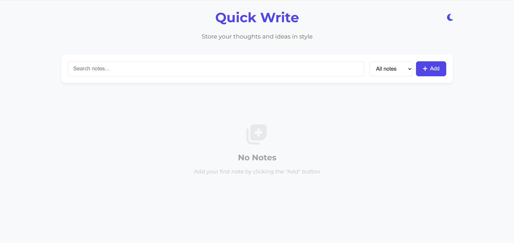

# Quick Write ✍️  
Quick Write is a simple and stylish note-taking web application that helps you store your thoughts, ideas, and tasks in an organized way. Built with a minimal UI, it allows users to create, categorize, search, and manage notes with ease.  

## 🌐 Live Demo  
👉 [Try Quick Write here](https://quick-notes-diwaker.netlify.app/)  

## 🚀 Features  
- 📝 Add and delete notes  
- 🔍 Search notes instantly  
- 🗂️ Categorize notes (e.g., Personal, Work)  
- 🌗 Light/Dark mode toggle  
- 📅 Automatic timestamp for each note  
- 🎨 Clean and modern UI with responsive design  

## 🛠️ Tech Stack  

-   
-   
-   
- **Storage**: LocalStorage  


## 📸 Screenshot  
  

## 📂 Installation  
```bash
# Clone the repository
git clone https://github.com/your-username/quick-write.git

# Navigate into the project folder
cd quick-write

